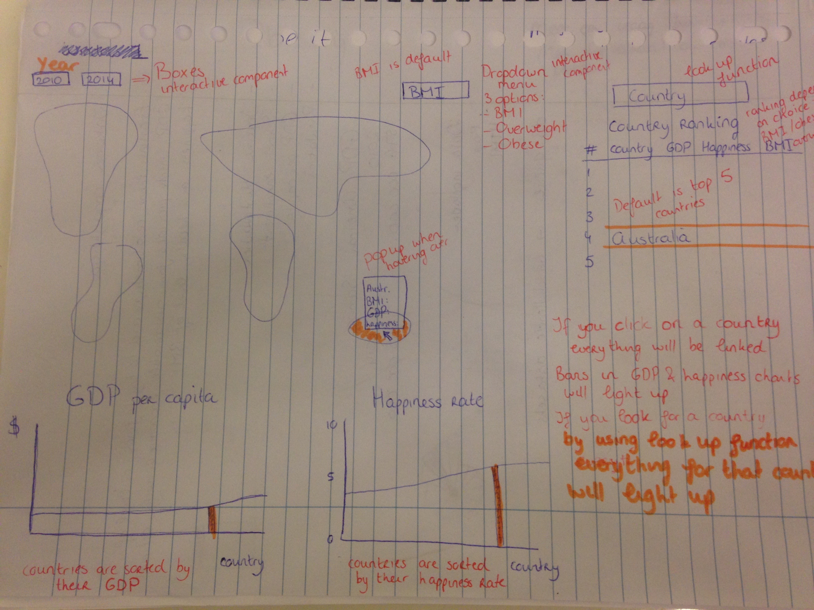

# Design Document

## Visualizations

### Visualizations 1 (MVP)
A world map where the obesity rate of countries is shown. If you hover over a specific country the information will be displayed in a pop-up (country, population, GDP, happiness, BMI/overweight/obesity). For this map there is a drowdown menu where you can choose between IBM/overweight/obesity and there will be two checkboxes where you can choose between 2010 and 2014. If you click on a country the bars from that country will light up in the two barcharts and the table. The countrycode will be used as the key which is able to link all the visualizations. The default setting will display the BMI per country in 2014.

### Visualization 2 (MVP)
A bar chart will display the GDP ranking of that country. The x-axis will be the countries and the y-axis will be the GDP per capita in US dollars. The countries will be sorted from lowest to highest GDP. This barchart will be linked with the worldmap, happines bar chart and the table.

### Visualization 3 (MVP)
A bar chart displaying the happiness of a country. The x-axis will display the countries and the y-axis the happiness rate on a scale from 1 to 10. The countries will be sorted from lowest to highest rate. This barchart is linked to all other visualizations.  

### Visualization 4 (MVP)
A table displaying the country name, BMI/overweight/obesity country ranking, GDP, happiness rate and the BMI/overweight/obesity. It will be possible to look for a specific country using a look up function and to sort the list by all these different variables. This table will also be linked to the worldmap and the barcharts. By default this will display the top 5 countries.

## Sketch

## Data
* GDP and Population - Worldbank
* BMI, overweight and obesity - World Health Organization
* Happiness rate - Wikipedia

The missing GDP numbers are complemented by numbers from other datasets:
* American Samoa - bea

I will try to load all the 6 different csv files in one JSON file with the following structure:

{"2010": {"DZA": {"country": "Algeria",
					"population": ...,
					"weight": [{"category": "BMI", "fillkey": "A"},
								{"category": "overweight", "fillkey": "B"},
								{"category":, "obesity", "fillkey": "B"}],
					"GDP": "1000",
					"happiness": "6,7"},
		"EGY": {...}},

"2014": {"DZA": ...}}

The BMI/overweight/obesity data and the happiness rate data first needs to be connected with the countrycodes from a separate countrycode python file.

## Libraries

I will use the following libraries:
* D3 - //cdnjs.cloudflare.com/ajax/libs/d3/3.5.3/d3.min.js
* Topojson - //cdnjs.cloudflare.com/ajax/libs/topojson/1.6.9/topojson.min.js
* jQuery - http://code.jquery.com/jquery-latest.min.js
* Bootstrap javascript - //netdna.bootstrapcdn.com/bootstrap/3.1.1/js/bootstrap.min.js
* Bootstrap stylesheet - //netdna.bootstrapcdn.com/bootstrap/3.1.1/css/bootstrap.min.css
* Datamaps javascript - /datamaps.world.min.js
