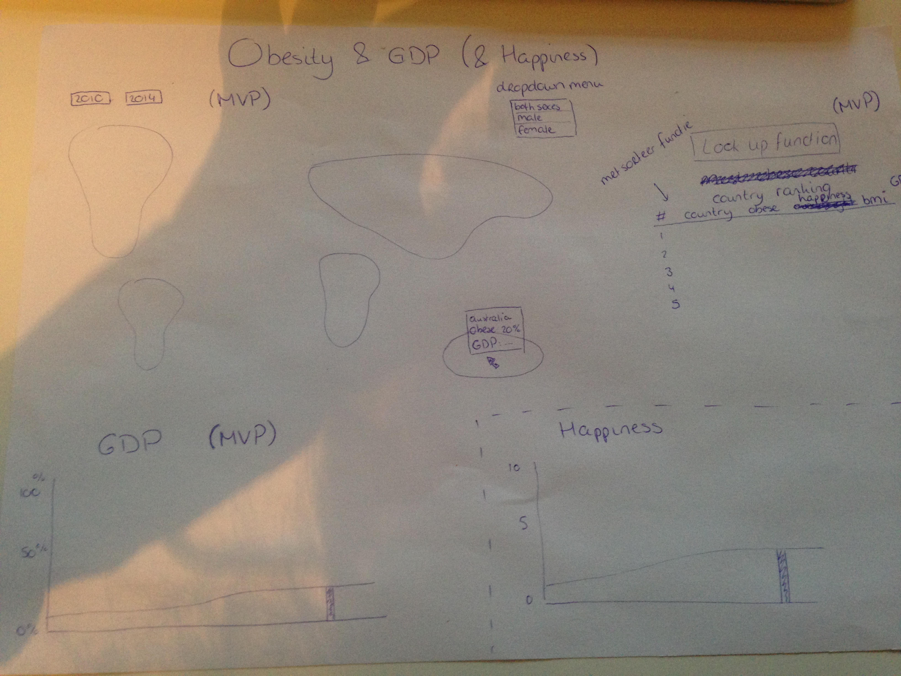

# Programmeerproject
Final project - D3 Visualization

# Project proposal

## Concept

The prosperity of a country, commonly measured in terms of its annual per capita Gross Domestic Product (GDP), might have different relationships with population levels of body weight and happiness. In this visualization I want to show if there are any trends detectable using these variables.  

## Visualizations

### Visualizations 1 (MVP)
A world map where the obesity rate of countries is shown. If you hover over a specific country the information will be displayed in a pop-up. For this map there is a drowdown menu where you can choose between both sexes/male/female and there will be two checkboxes where you can choose between 2010 and 2014. 

### Visualization 2 (MVP)
A bar chart will display the GDP ranking of that country as a percentage of the total GDP per capita. This barchart will be linked with the worldmap. 

### Visualization 3 (MVP)
A table displaying the country, obesity ranking, obese percentage, bmi and gdp. It will be possible to look for a specific country and to sort the list by all these different variables. This table will also be linked with the worldmap

### Visualization 4
A bar chart displaying the happiness of a country. Also linked to all other visualizations. 

## Data

As datasets I will use data from the worldbank for the GDP. I will use obesity data from the World Health Orginization. The happiness is available at Wikipedia. 

## APIs and technical problems

I will use the worldmap from datamaps.github.com. I will probably encounter a lot of technical problems. We have never tried to implement so many different visualizations on one page. They all have to be linked and updated once a user changes something.  