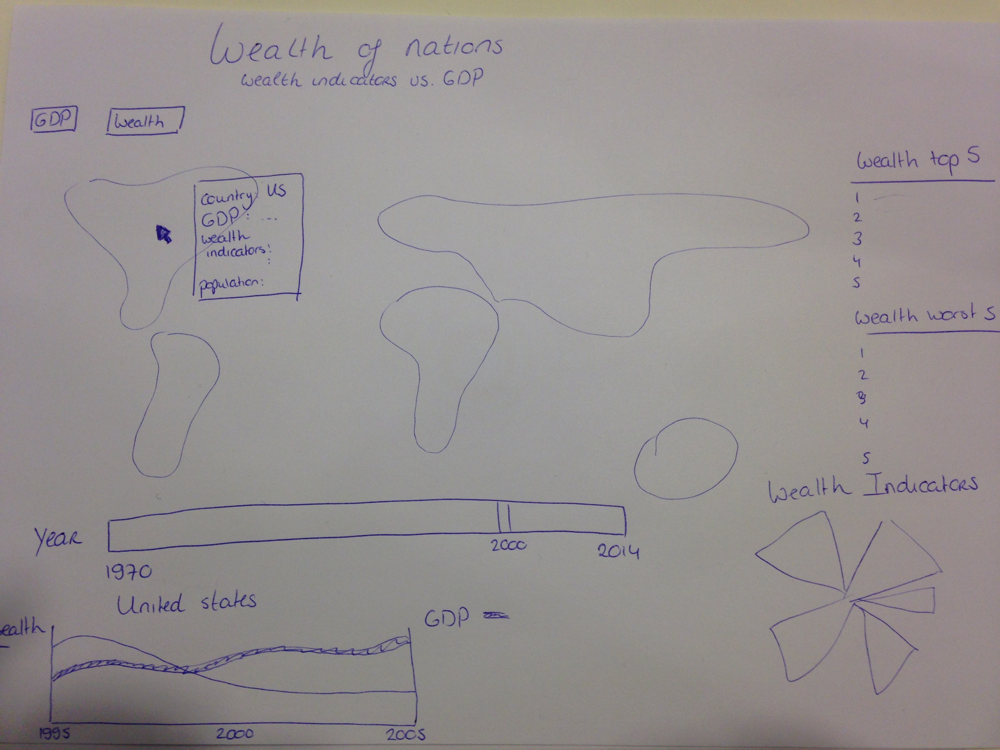

# Programmeerproject
Final project - D3 Visualization

# Project proposal

## Concept

Often GDP is used as a indicator of a country's economic performance. However, this only measures income, not wealth or how wealth is changing. GDP tells nothing about the long term sustainability of a country. Specific wealth indicators do account for this. 

I would like to visualize the Wealth Indicators vs. the GDP per country in a world map. I would like to compare if the countries with the highest GDP also the countries with the highest wealth indicators are. 

## Visualisations

On the left top side of the page I am planning to show a worldmap displaying the GDP/wealth indicators in category groups (different colors), where you can toggle between GDP and wealth indicators (Interactive component 1). (Visual component 1) As you hover over the country a pop-up will show more information.

Under the worldmap there is a slider displayed where you can choose a year. (Interactive component 2)

On the right side of the world map there is a list of the top and worst 5 countries by the GDP or Wealth indicators (depending on users choice)

Left under the world map I want a bar/line chart displaying the GDP/Wealth growth over 10 years (Visual component 2).

Finally on the right side I want to display a specifications of the wealth indicators. It's not totally clear yet how I want to display these. (Visual component 3)

## Data

As datasets I will use data from the worldbank. They have a seperate set named 'Wealth Accounting' which I can use for my wealth indicators. 

## APIs and technical problems

I will use the worldmap from datamaps.github.com. I will probably encounter a lot of technical problems. We have never tried to implement so many different visualizations on one page. They all have to be linked and updated once a user changes something.  