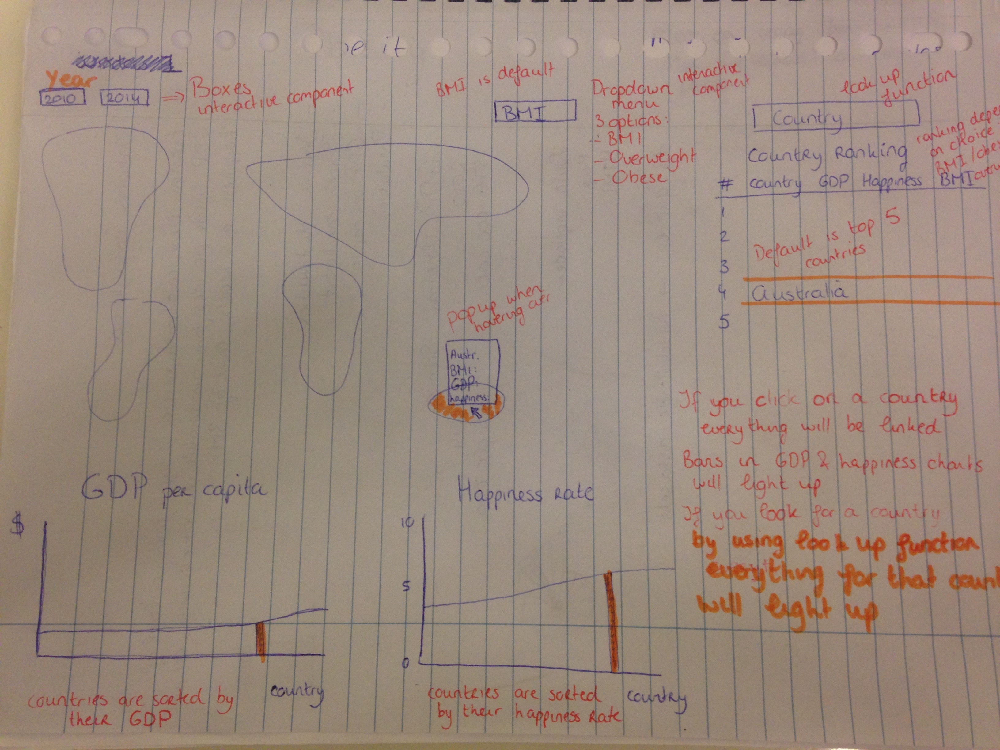

# Project proposal

## Concept

The prosperity of a country, commonly measured in terms of its annual per capita Gross Domestic Product (GDP), might have different relationships with the body weight and happiness of a population. In this visualization I want to show if there are any trends detectable examining these variables. I want to examine if there is a level of GDP which provides for optimal happiness and a healthy level of BMI. 

## Visualizations

### Visualizations 1 (MVP)
A world map where the obesity rate of countries is shown. If you hover over a specific country the information will be displayed in a pop-up (country, population, GDP, happiness, BMI/overweight/obesity). For this map there is a drowdown menu where you can choose between IBM/overweight/obesity and there will be two checkboxes where you can choose between 2010 and 2014. If you click on a country the bars from that country will light up in the two barcharts and the table. The countrycode will be used as the key which is able to link all the visualizations. The default setting will display the BMI per country in 2014.

### Visualization 2 (MVP)
A bar chart will display the GDP ranking of that country. The x-axis will be the countries and the y-axis will be the GDP per capita in US dollars. The countries will be sorted from lowest to highest GDP. This barchart will be linked with the worldmap, happines bar chart and the table.

### Visualization 3 (MVP)
A bar chart displaying the happiness of a country. The x-axis will display the countries and the y-axis the happiness rate on a scale from 1 to 10. The countries will be sorted from lowest to highest rate. This barchart is linked to all other visualizations.  

### Visualization 4 (MVP)
A table displaying the country name, BMI/overweight/obesity country ranking, GDP, happiness rate and the BMI/overweight/obesity. It will be possible to look for a specific country using a look up function and to sort the list by all these different variables. This table will also be linked to the worldmap and the barcharts. By default this will display the top 5 countries.

## Data

As datasets I will use data from the worldbank for the GDP. I will use obesity data from the World Health Orginization. The happiness is available at Wikipedia. 

## Libraries and technical problems

I will use the worldmap from datamaps.github.com. I will probably encounter a lot of technical problems. We have never tried to implement so many different visualizations on one page. They all have to be linked and updated once a user changes something.  