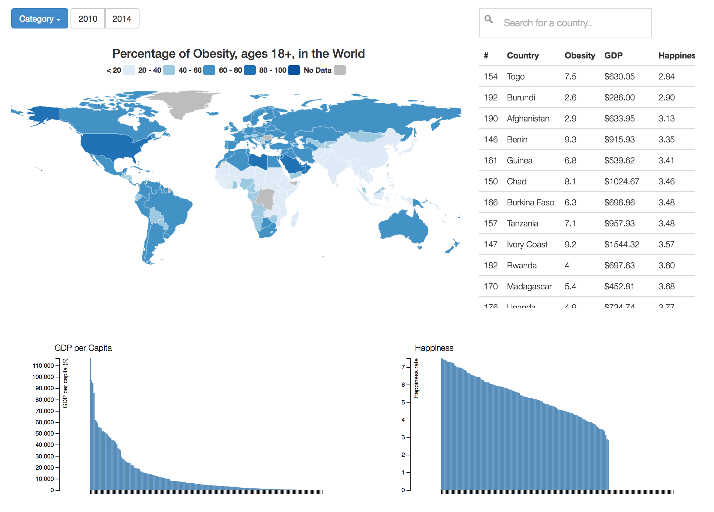

# Final Report

## Description

The body weight of the population in a country might have different relationships with prosperity of a country, commonly measured in terms of its annual per capita Gross Domestic Product (GDP), and happiness of a population. In these visualizations the relationship between the body weight of a population and the level of income and happiness is examined.  

On the top left corner a worldmap is displayed, visualizing data from the World Health Organization about the BMI and the percentage of obesity and overweight in different countries. Using a dropdown menu the user can toggle between these three different categories. The title and the legend are adjusted according to the category the user has chosen. If the user hovers over a specific country a tooltip is shown where the name of the country and the exact number of the chosen category is shown. I have used a sequential color scheme, where the higher the BMI or the percentage overweight or obesity, the darker the country is colored. Also, the user can select either the year 2010 or 2014 by clicking on one of the buttons next to the dropdown menu. The default setting is the category obesity in 2014. 
On the bottom left corner a barchart is displayed, either visualizing data about the GDP per capita per country (default setting) from the World Databank or data about the level of happiness from Wikipedia. The user is able to switch between these two by clicking on one of the two buttons. The bars are sorted from highest to lowest and if you hover over a specific country the name of that country and the level of GDP/Happiness is displayed. The two buttons for the different years (2010 & 2014) also apply to the barchart.
On the bottom right corner a scatterplot is displayed, either visualizing data about the level of happiness per country (default setting) or data about the GDP per Capita, both versus the selected weight category by using the dropdownmenu on the top left corner of the page. The same hover features and year options as for the barchart apply to the scatterplot.
Lastly, on the top right corner all the data is collectively shown in a table. In this table you can look for a specific country and sort every column from lowest to highest.
All the visualizations are connected with each other: if you hover over a specific country in one of these four visualization, the specific country will change color in every single visualization. 


## Technical Design

My project is composed of various files. For the four different visualizations, described above, I made different files, i.e. worldmap.js, barchart.js, scatterplot.js and table.js containing the functions drawing these visualizations. The functions which are used by more than one visualizations, are gathered in one file, helper.js. In the main javascript file, index.js, the global variables are defined, the json file is loaded into javascript, all the functions from the separate javascript files are called and updated on 'click' events. At first, everything was gathered in one single javascript file and I had a lot of duplicate code, leading to very unorganized code and a 4 out of 10 when checking my code on Better Code Hub. After the separation of files and making functions for duplicate code, checking my code on Better Code Hub led to a 7 out of 10. I do have all my CSS code in one file, because I thought it was not necessary to create five different CSS files with all 10 lines of code, this would only lead to more chaos in my opinion. All these javascript files and the single CSS file are excecuted by one single html file. In this html file all the buttons, the dropdownmenu and the different containers for the visualizations are created. 

All the data from different CSV files is converted by the python file convert2JSON.py into one JSON file. This JSON file is directly loaded into the worldmap function in the worldmap.js file. The other visualizations needed a different form of dictionary, therefore, in the functions for the other visualizations the data is first converted by using the prepareData() function, which can be found in the helper.js. In the prepareData() function one argument is called 'table'. In the functions for the table, scatterplot and barchart this argument is answered with 'yes' or 'no', meaning this visualization is a table or not. Because for the barchart and the scatterplot the countries with no datapoints have to be removed from the dictionary, whereas for the table this is not necessary. Because events for moving the mouse, changing the color of the buttons when a button is selected, displaying the source of the data and creating a tooltip apply to more than one visualization, the functions for these features are all gathered in one single helper.js file.

In order to draw the worldmap I have used the worldmap from DataMaps, with the built-in functions for the legend and the coloring of the countries. The legend is drawn by using the function drawLegend() and differs for the various categories. The, sourceVis() (source of the visualization), addTooltip(), mouseOver() and mouseOut() functions (in helpers.js), I have written myself. When the user moves the mouse over a specific country, a popup with information about the country is displayed and this specific country is also shown in the barchart, scatterplot and the table. In barchart.js the function drawBarchart() is written and in scatterplot.js the function drawScatterplot(). Both these functions make also use of all the functions written in the helper.js file. This also applies to the drawTable() function in the table.js file, but on top of these, the functions Searchfunction() and valueCompare() are written. The first mentioned ables the user to search for a specific country in the table, by looping through all the table rows and hiding those who don't match the search query. The second one ables to user to sort a specific row from lowest to highest, where the 'No Data' points are asigned the value infinity causing them to appear on the bottom of the sorted column. 

All the specific functions for the visualizations depend on the arguments 'data', 'year', 'category' and 'variable'. These arguments are hardcoded by default the first time the user loads the webpage. By using the dropdown menu and the different buttons on the page these arguments will change, and the visualizations will update automatically. This happens because the values of the distinct buttons and dropdown menu options are stored in a global variable in the index.js file and these variables are passed on to the functions as the arguments 'year', 'category' and 'variable'. Then, when the user clicks on a button, the visualizations based on the previous arguments are removed and the visualizations depending on the updated arguments are redrawn.

The two buttons in a buttongroup have either the value '0' or '1', and respectively the id 'type + 0' or 'type + 1', where type is the type of the visualizations, i.e. map, bar or scatter. When the user clicks on a specific button the function buttonColor() first checks if this button is already selected, if this is not the case the button in the selected buttongroup with the corresponding id to the value, e.g. value '0' and id 'bar0', is colored darkgrey (the color for a selected button) and the button with the contrary id, e.g. id 'bar1', is colored lightgrey (the color for an unselected button). Thus, in each of the three buttongroups (one for the map, one for the barchart and one for the scatterplot) one of the two buttons is darkgrey, meaning selected, and one is lightgrey, meaning unselected. 

All the countries in the different visualizations are connected by using the same id, 'countrycode', for the same country in every visualization, i.e. the id for the country in the worldmap, for the bar in the barchart, for the dot in the scatterplot and for the row in the table of, let's say, the Netherlands is all 'NLD'. So when the user hovers over a country in one of the visualizations, the countrycode of this particular country is saved in a variable, all the elements with '#' + 'this countrycode' as id are selected and all these change color. Next, when the user leaves the element with his mouse, all the elements restore to their former color. 


## Challenges

The first challenge I encountered was that by using my ideal devised JSON format, I could not give the countries in my worldmap a distinct color according to their fillKey, because the key fillKey was one layer deeper in the JSON file than the colorfunction built in the worldmap from DataMaps was able to work with:

```
"year": {"countrycode": {"country": .., "weight": [{"category": BMI, "fillKey": A}, 
													{"category": Overweight, "fillKey": A}, 
													{"category": Obesity, "fillKey": A}],
						"GDP": ..,
						"happiness": ..},
		{"countrycode": ...}},
"year": ... }}}
```

Therefore, I changed my JSON format to the less efficient form:

```
"year": {"BMI": 	{"countrycode": {"country": .., 
									"fillKey": ..,
									"GDP": ..,
									"happiness": ..,
									"countrycode": ..},
					{"countrycode": ...}}},
		{"Obesity": {"countrycode": {"country": .., 
									"fillKey": ..,
									"GDP": ..,
									"happiness": ..,
									"countrycode": ..},
					{"countrycode": ...}}},

		{"Overweight": {"countrycode": {"country": .., 
										"fillKey": ..,
										"GDP": ..,
										"happiness": ..,
										"countrycode": ..},
					{"countrycode": ...}}},
"year": ... }}}
```

where the size of my JSON increase by a factor 3. The next challenge was also caused by the form of my JSON file, because, although the form was perfect for my worldmap, it did not work for my barchart, scatterplot and table functions. Then, a girl from my daily standup brought up that I could reformat my JSON file in these functions itself for these visualizations by creating a new dictionary in these functions according to the proper format. No sooner said than done, and in this way it was really easy to remove the 'No Data' points from my dictionary when drawing the barchart and the scatterplot, because these points led to very strange elements in these two graphs, e.g. in the scatterplot these points appeared as dots in the top left corner. 

I also encountered some trouble with the sort function in my table. The first implementation of the sort function was very buggy, because if you sorted on two different categories one after the other, the second time you wanted to sort a different column you had to click twice on the header to get the column properly sorted. Also, 'No Data' points were randomly distributed over the column when you wanted to sort this column. Lastly, only the numerical values were properly sorted, the alphabetical still went wrong. Therefore, I looked for a new sorting algorithm on the internet and implemented this. The 'No Data' points remained a problem, they were still randomly distributed over the column when you wanted to sort this column. I solved this by assigning these points an inifinite number in my sorting algorithm, causing them to appear on the bottom of the sorted column, which has been the aim the whole time. I also used the try/catch structure to first try to change the characters to lowercase characters, if this fails (because the characters are numbers), catch this error and sort the numbers. 

My biggest challenges were the mouseOver and mouseOut functions of the worldmap and the connectivity of all the graphs. Initially, I was planning on using the built-in mouseOver function, i.e. popupTemplate, on the worldmap from the DataMaps file. I had already customized the tooltip and the hover colors for the countries when I wanted to connect the worldmap to the other graphs. However, adding another mouseOver event to the already existing function popupTemplate turned out to be impossible. Either the tooltip and the hover colors appeared, or the connection with the other graphs came into sight. It took me a while, but finally I figured out how to write my own function for the tooltip of the worldmap. I also had to recover the original color of the country when the mouse left that particular country, which was difficult to detect because all the countries have a different color, but luckily another student, Florinde Vessies, helped me with this. Consequently, I didn't have to use the popupTemplate function anymore and this problem was fixed. The connectivity was implemented once I figured that a distinct id, namely the countrycode, could be assigned to every element in the graphs, meaning that for example the country, dot and bar of the Netherlands all have the same id 'NLD'. So, when the user hovers over a country, the countrycode of this specific country is stored, and by using d3.selectAll('#' + countrycode).style('fill', hovercolor) both the country, bar and dot are colored with the hovercolor at once. 

The final big challenge I faced was the colorchange of the buttons when they changed from being selected to unselected or the other way around. It was difficult to fix that once a button is selected, the color wouldn't change even if you clicked on it. Once I had fixed that, the buttons did not change color any more once the user would switch from one buttongroup to another. Finally, I solved this problem by assigning the value '0' or '1' and respectively the id 'type + 0' or 'type + 1', where type is the type of the visualizations, i.e. map, bar or scatter, as explained before in the section Technical Design. 

Regarding my Design Document, the original plan was to make a worldmap displaying the data per weight category, two barcharts, where the first graph displayed the GDP per capita per country and the second graph displayed the level of happiness per country, and a table displaying all the data together, as can be seen in the screenshot below.



However, I changed my original plan concerning the two barcharts. The plan for the two separate barcharts I combined in one barchart, where a button makes the user able to switch between the two different datasets. Instead of the second barchart, a scatterplot is displayed where the Happiness or GDP versus the chosen weight category is displayed, again the user can choose between Happiness or GDP by clicking on one of the two buttons on the top left corner of the graph. It is noteworthy to remark how easy it was to transform my barchart to a scatterplot because of the intensive programming of the past five months.  

## Ideal World
The applications meets all the functional requirements and more. The change from the intended two barcharts to one barchart and one scatterplot was a good decision because it made the application more informative and diversive. For this application I only examined the data for 2 years, i.e. 2010 and 2014, because the first time I checked the site of the World Health Organization this was the only data available. However, a week later they published the data from 1975 up to 2014, which is even more informative than only displaying two years. I started expanding the datasets but discovered after two days of work, that I simply would not have enough time to expand all the data and adjust all the functions for the visualizations to obtain a flawless application before the deadline. So in an ideal world I would expand the dataset and show the data for more than two years on my webpage. Also, with more time I would add some small features as transitions between graphs, fixed headers instead of scrollable ones, learn how to use the update function instead of remove, write a function for displaying the tooltip with a mouseover event, make the user able to also sort from highest to lowest instead of only from lowest to highest and roll to a specific row of the table once the user clicks on a country, bar or dot in the scatterplot. Nonetheless, even thought a lot could be improved upon this application, I have learned a great deal in the past five months and am satisfied with the final product. 