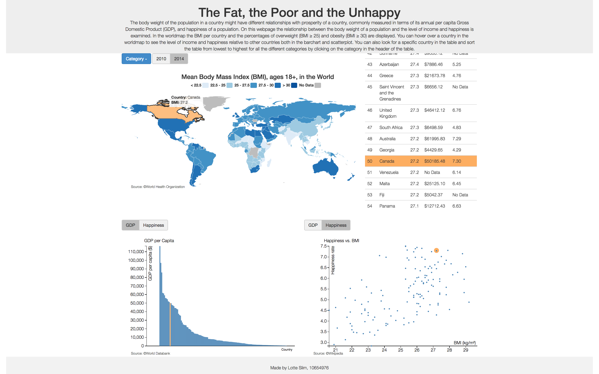

Create the final report
Create a report (REPORT.md), based on your design document, containing important decisions that you’ve made, e.g. where you changed your mind during the past weeks. This is how you show the reviewer that you actually understand what you have done.

Start with a short description of your application (like in the README.md, but very short, including a single screen shot).

Clearly describe the technical design: how is the functionality implemented in your code? This should be like your DESIGN.md but updated to reflect the final application. First, give a high level overview, which helps us navigate and understand the total of your code (which components are there?). Second, go into detail, and describe the modules/classes and how they relate.

Clearly describe challenges that your have met during development. Document all important changes that your have made with regard to your design document (from the PROCESS.md). Here, we can see how much you have learned in the past month.

Defend your decisions by writing an argument of a most a single paragraph. Why was it good to do it different than you thought before? Are there trade-offs for your current solution? In an ideal world, given much more time, would you choose another solution?

Make sure the document is complete and reflects the final state of the application. The document will be an important part of your grade.

# Report

## Description

The prosperity of a country, commonly measured in terms of its annual per capita Gross Domestic Product (GDP), might have different relationships with the body weight and happiness of a population. In this visualization I want to show if there are any trends detectable examining these variables. I want to examine if there is a relationship between a healthy body weight and a certain level of income and happiness. 

On the top left corner a worldmap is displayed, visualizing data from the World Health Organization about the BMI and the percentage of obesity and overweight in different countries. Using a dropdown menu the user can toggle between these three different categories. The title and the legend are adjusted according to the category the user has chosen. If the user hovers over a specific country a tooltip is shown where the name of the country and the exact number of the chosen category is shown. I have used a sequential color scheme, where the higher the BMI or the percentage overweight or obesity, the darker the country is colored. Also, the user can select either the year 2010 or 2014 by clicking on one of the buttons next to the dropdown menu. The default setting is the category obesity in 2014. 
On the bottom left corner a barchart is displayed, either visualizing data about the GDP per capita per country (default setting) from the World Databank or data about the level of happiness from Wikipedia. The user is able to switch between these two by clicking on one of the two buttons. The bars are sorted from highest to lowest and if you hover over a specific country the name of that country and the level of GDP/Happiness is displayed. The two buttons for the different years (2010 & 2014) also apply on the barchart.
On the bottom right corner a scatterplot is displayed, either visualizing data about the level of happiness per country (default setting) or data about the GDP per Capita, both versus the selected weight category by using the dropdownmenu on the top left corner of the page. The same hover features and year options as for the barchart apply on the scatterplot.
Lastly, on the top right corner all the data is collectively shown in a table. In this table you can look for a specific country and sort every column from lowest to highest.
All the visualizations are connected with each other: if you hover over a specific country in one of these four visualization, the specific country will change color in every single visualization. 

## Technical Design
* High level overview

My project is composed of various files. For the four different visualizations, described above, I made different files, i.e. worldmap.js, barchart.js, scatterplot.js and table.js containing the functions drawing these visualizations. The functions which are used by more than one visualizations, are gathered in one file, helper.js. At first, everything was gathered in one single javascript file and I had a lot of duplicate code, leading to very unorganized code and a 4 out of 10 when checking my code on Better Code Hub. After the separation of files and making functions for duplicate code, checking my code on Better Code Hub led to a 7 out of 10. I do have all my CSS code in one file, because I thought it was not necessary to create five different CSS files with all 10 lines of code, this would only lead to more chaos in my opinion. All these javascript files and the single CSS file are excecuted by one single html file. In this html file all the buttons, the dropdownmenu and the different containers for the visualisations are created. 